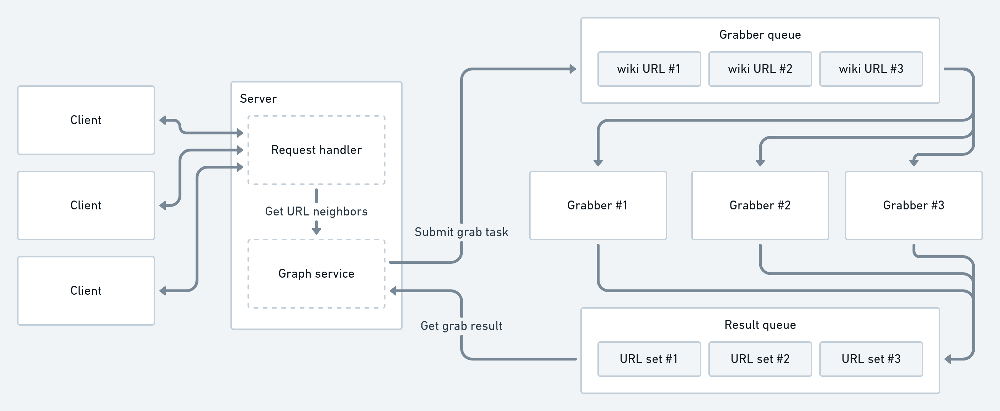

# Pathfinder

Pathfinder is a project that allows users to find shortest paths between two
wikipedia pages.

# Overview

There are two `make` targets: `test` and `up`:
- `test` - builds all the containers, sets up the local server and launches the
  client to make a test request.
- `up` - sets up the server workers for deployment

Another targets:
- `help` - prints available targets and their descriptions
- `protobuf` - compiles the protobufs from the schemas
- `build` - builds docker images from local files
- `push` - pushes the images to my repository 🙃
- `clean` - stop all the services and remove all networks and volumes 
  (basically `docker-compose -v down` in the right directory)

# Prerequisites

- Docker
- Docker-compose

# Configuration

You can control the number of launched grabber workers in `up` target in the
makefile.

# Simple start 

```bash
export RABBITMQ_USER=guest RABBITMQ_PASS=quest; \
source <(curl -s https://raw.githubusercontent.com/SphericalPotatoInVacuum/soa-message-queues/main/scripts/start_server.sh)
```

# Simple tests

```bash
export RABBITMQ_USER=guest RABBITMQ_PASS=quest; \
source <(curl -s https://raw.githubusercontent.com/SphericalPotatoInVacuum/soa-message-queues/main/scripts/run_tests.sh)
```

# Design

This section roughly describes the logic and interaction between all the
components and actors of the system.

## Architecture



## Client

The client sends the RPC request with two Wikipedia URLs to the server and
waits for the answer.

## Server

The server consists of two main parts: the Request Handler and the Graph
Service. Each client request is handled the Request Handler. While processing 
the request, the handler makes requests to the Graph Service.

## Request handler

Handles RPC requests from the clients. For each request starts traversing the
graph using modified BFS. The neighbors of the wiki URLs are received from the
Graph Service. Because such a request can take a long time, we want to make as
many of these requests as possible in parallel. Because of the nature of BFS we
can only parallelize requests about nodes on the next level of the search, and
we need to scan all the results, before we can start making more requests.

We do this to not overwhelm our queue with requests that won’t be needed - for
example we requested to know the neighbors of all the nodes on the first three
levels, and found the answer in the first level and now we don’t need all those
requests anymore.

Because of these requirements the final BFS is implemented like this: we have
two queues, one for the nodes that we will scan on this iteration, and an
intermediate buffer, where we will put neighbors of the nodes we take from the
main queue in parallel. The algorithm is as follows:

1. Take node from queue. If queue is empty, go to step (3)
2. Submit a task to get its neighbors to be executed in the background
3. For each node in buffer (that can be updated at the same time by submitted 
   tasks) until it is empty (no tasks will add anything to it):
    1. Check if it is the final node and we found the path. Return this path 
       and cancel all running tasks.
    2. Add the new path to the main queue to be processed on the next algorithm
       iteration
4. Go to (1)

## Graph service

Holds a graph of wiki in the memory. When created launches a background routine
that waits for results coming from the Results Queue and forwards them to the
routines that wait for them (pass task id with the result to know who is the 
waiter).

When the new request for the node neighbors comes from the Request Handler do
the following:

1. If we already have the node marked as “discovered” then just return all its
   neighbors.
2. If the node hasn’t yet been “discovered”, then push a new task to the 
   Grabber Queue

## Grabber

Simple worker that gets new tasks from the Grabber Queue, fetches the 
corresponding Wikipedia page and returns the results to the Result Queue.
